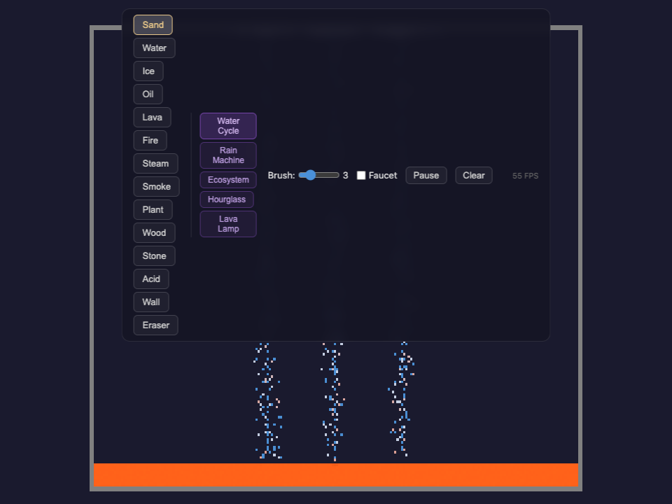
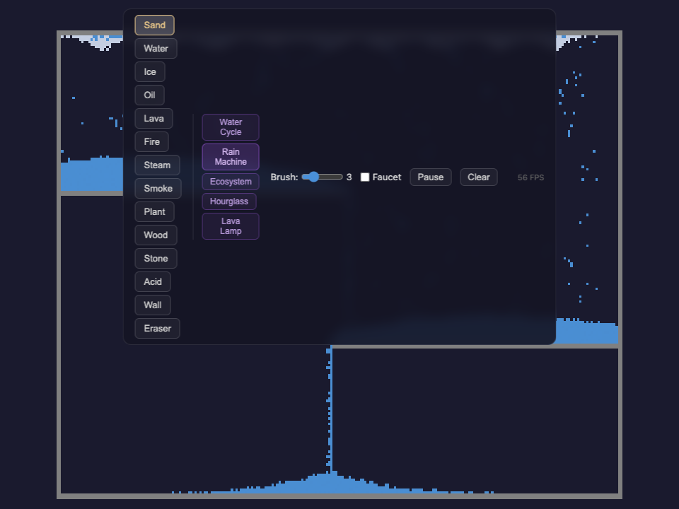
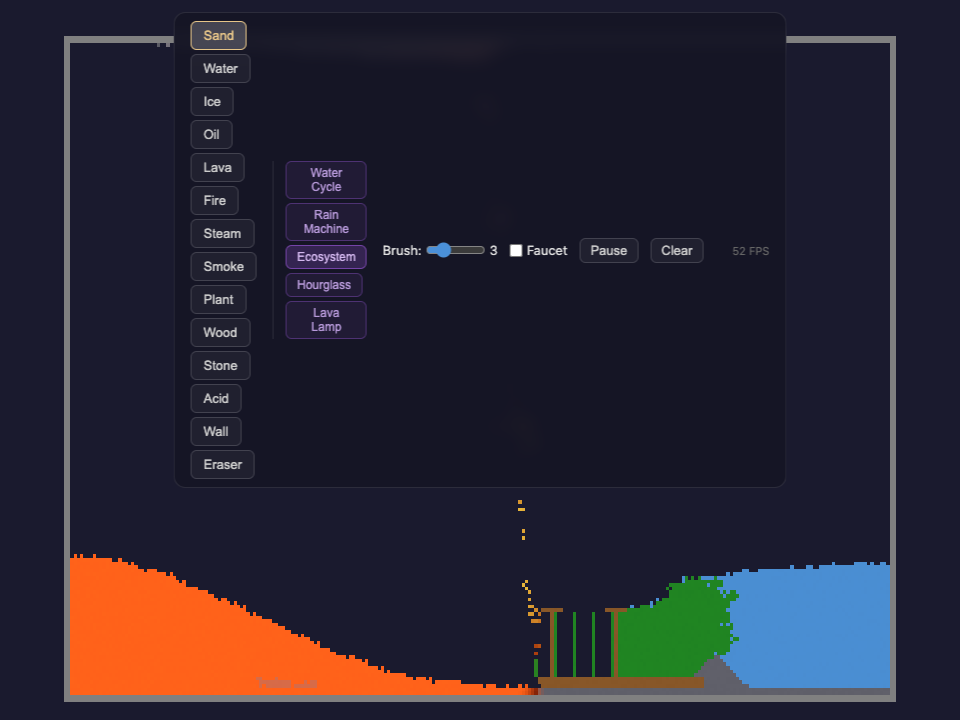
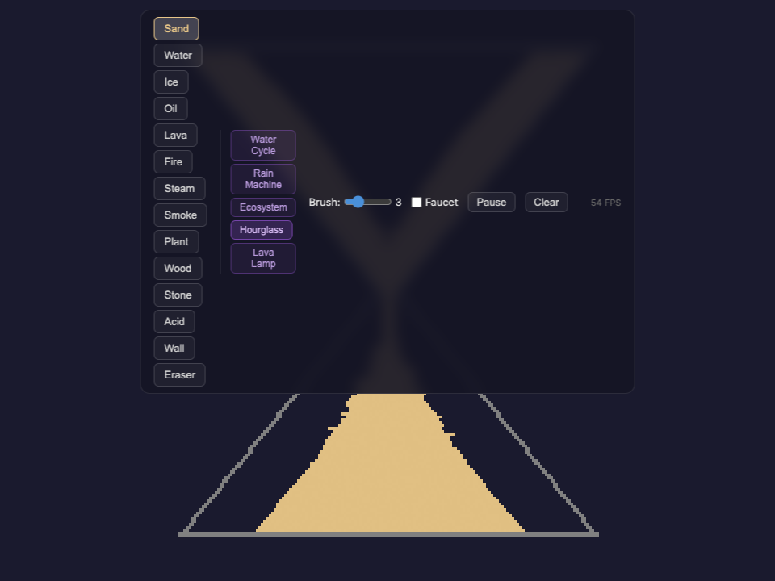
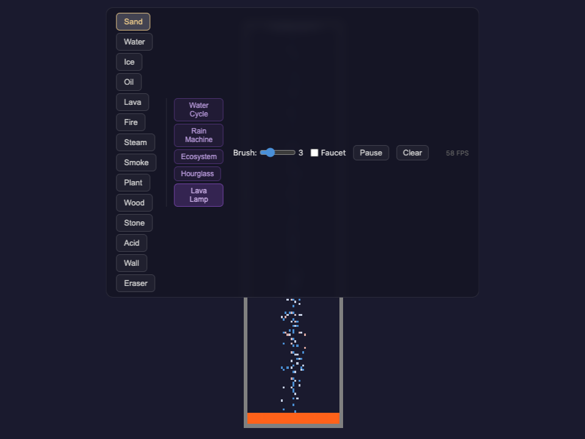

# Falling Sand

A web-based particle physics sandbox inspired by classic falling sand games. Draw with 14 different elements — sand, water, lava, plants, acid, and more — and watch them interact with heat conduction, phase transitions, and density-based physics.


## Scenarios

Preset scenarios set up self-running simulations you can watch evolve.

| Water Cycle | Rain Machine | Ecosystem |
|:-----------:|:------------:|:---------:|
|  |  |  |
| Water drips onto lava, creates steam that rises and condenses | Steam faucets condense into rain that cascades down terraced platforms | Lava, water, ice, plants, and wood in a balanced walled garden |

| Hourglass | Lava Lamp |
|:---------:|:---------:|
|  |  |
| Sand flows through a narrow neck from top to bottom chamber | Water drips through an air column onto a lava pool, creating a convection cycle |

## How it works

- **Rust/WASM** handles the cellular automata simulation (~18KB optimized)
- **WebGL2** renders the particle grid as a texture with per-particle color variation
- **TypeScript** manages the UI, mouse/touch interaction, and game loop

### Elements

- **Sand** — falls, piles diagonally, sinks through liquids
- **Water** — flows down, spreads horizontally, fills containers
- **Oil** — floats on water (lower density), has higher viscosity
- **Lava** — heats neighbors, turns water to steam
- **Steam** — rises, condenses back into water when cooled
- **Ice** — melts into water when heated
- **Fire** — ignites wood and plants, produces smoke
- **Plant** — grows when touching water, burns when ignited
- **Wood** — solid, flammable fuel source
- **Stone** — dense, immovable solid
- **Acid** — dissolves most materials on contact
- **Smoke** — rises and dissipates
- **Wall** — indestructible barrier

## Prerequisites

- [Rust](https://rustup.rs/) with the `wasm32-unknown-unknown` target
- [wasm-pack](https://rustwasm.github.io/wasm-pack/installer/)
- [Node.js](https://nodejs.org/) (v18+)

## Setup

```bash
# Install wasm target (if not already)
rustup target add wasm32-unknown-unknown

# Install web dependencies
cd web && npm install && cd ..
```

## Development

```bash
npm run dev
```

Builds the WASM module and starts a Vite dev server at `http://localhost:5173`.

## Production build

```bash
npm run build
```

Output goes to `web/dist/`.

## Tests

```bash
cd web && npm test
```

Runs structural tests (scenario layouts, bounds checking) and simulation tests (WASM physics engine, species counts over time). Simulation tests write JSON logs to `web/sim-logs/` for analysis.

## License

MIT
