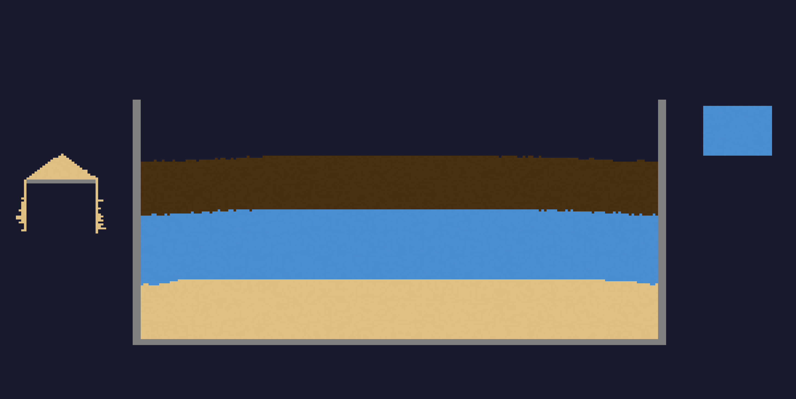
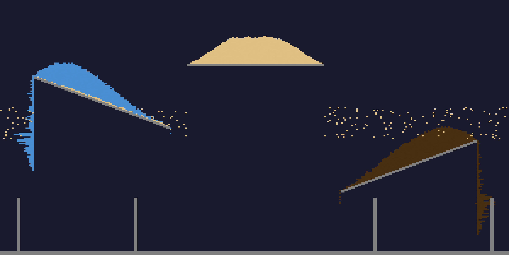

# Falling Sand

A web-based particle physics sandbox inspired by classic falling sand games. Draw sand, water, oil, and walls and watch them interact with realistic density-based physics.





## How it works

- **Rust/WASM** handles the cellular automata simulation (~18KB optimized)
- **WebGL2** renders the particle grid as a texture with per-particle color variation
- **TypeScript** manages the UI, mouse/touch interaction, and game loop

### Particle interactions

- **Sand** falls, piles diagonally, sinks through liquids
- **Water** flows down, spreads horizontally, fills containers
- **Oil** floats on water (lower density), has higher viscosity
- **Wall** blocks everything

## Prerequisites

- [Rust](https://rustup.rs/) with the `wasm32-unknown-unknown` target
- [wasm-pack](https://rustwasm.github.io/wasm-pack/installer/)
- [Node.js](https://nodejs.org/) (v18+)

## Setup

```bash
# Install wasm target (if not already)
rustup target add wasm32-unknown-unknown

# Install web dependencies
cd web && npm install && cd ..
```

## Development

```bash
npm run dev
```

Builds the WASM module and starts a Vite dev server at `http://localhost:5173`.

## Production build

```bash
npm run build
```

Output goes to `web/dist/`.

## License

MIT
